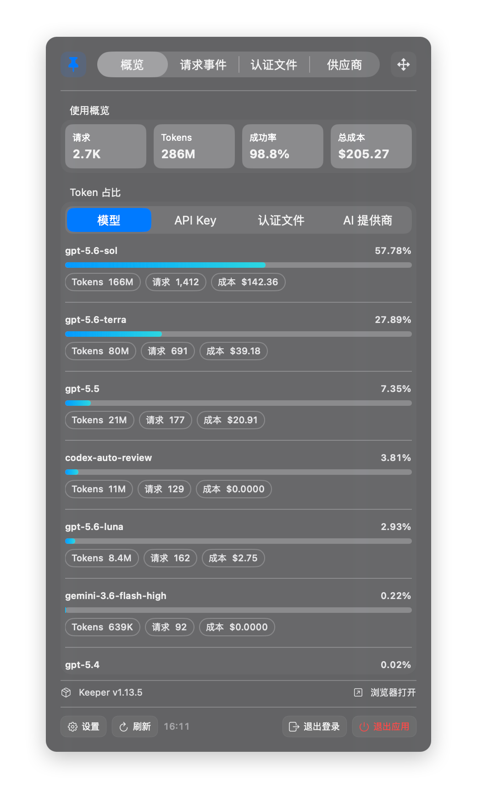
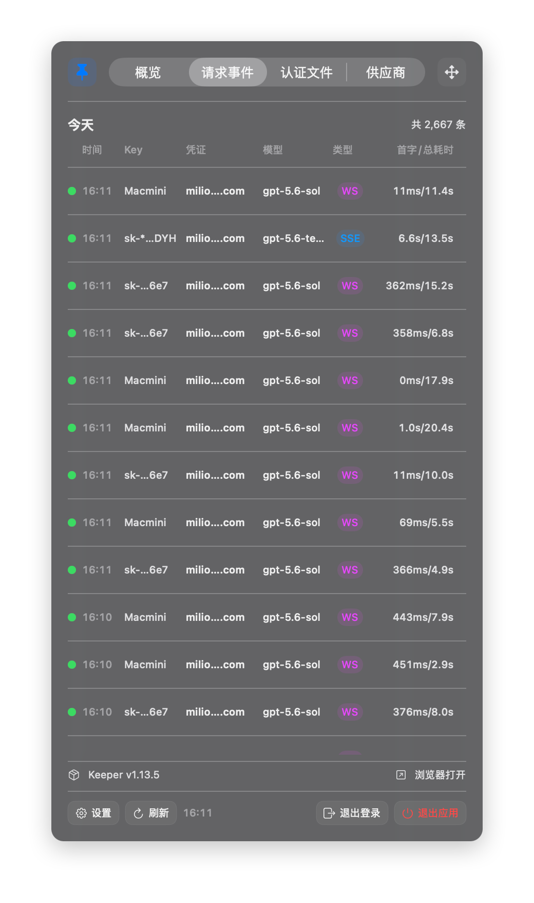
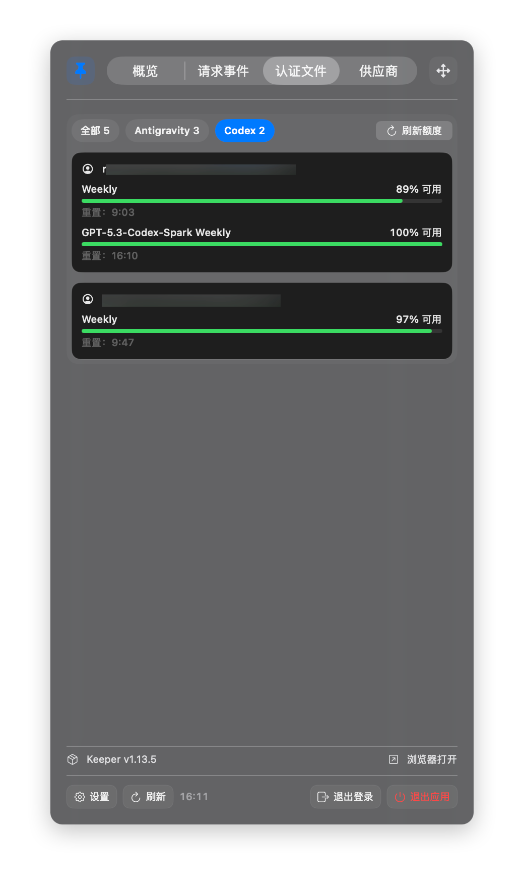

# CPA Monitor Bar

CPA Monitor Bar 是为 `cpa-usage-keeper` 定向开发的 macOS 菜单栏监控客户端。它把日常需要关注的使用概览、请求事件、认证文件限额和供应商健康情况压缩到一个轻量 Bar 窗口中，同时保留快速跳转到 Keeper Web 管理界面的入口。

- 当前版本：`1.1.0`
- 系统要求：macOS 26.5 及以上
- 架构：Apple Silicon（arm64）与 Intel（x86_64）Universal 2
- 技术栈：Swift、SwiftUI、Swift Package Manager

## 界面预览

点击截图可查看原图。

<table>
  <tr>
    <th>概览</th>
    <th>请求事件</th>
    <th>认证文件</th>
  </tr>
  <tr>
    <td><a href="Assets/Screenshots/overview.png"></a></td>
    <td><a href="Assets/Screenshots/request-events.png"></a></td>
    <td><a href="Assets/Screenshots/credentials.png"></a></td>
  </tr>
</table>

## 与 cpa-usage-keeper 的关系

本项目是 `cpa-usage-keeper` 的配套客户端，不替代 Keeper 服务或 Web 管理界面，也不是通用 CPA 管理工具。应用连接用户配置的 Keeper 根 URL，使用 Keeper 已有的管理会话和只读用量接口获取数据；底部会显示 Keeper 版本，并可直接在浏览器中打开对应 Web 页面。

当前针对性适配的内容包括：

- 服务健康、管理员会话、Keeper 状态和版本。
- 使用汇总、Token 构成和成本信息。
- 请求事件分页及 SSE / WS 类型、凭证、模型和延迟。
- 已启用认证账号及 Keeper 已缓存的限额数据。
- 供应商最近 5 小时请求健康趋势。

如果 `cpa-usage-keeper` 的接口路径或响应字段发生不兼容变化，本项目也需要同步适配。

## 功能

登录后提供四个页签：

- **概览**：请求数、Token、成功率和总成本，以及按模型、API Key、认证文件和 AI 提供商切换的 Token 占比。
- **请求事件**：展示所选时间范围的请求总数、结果、时间、Key、凭证、模型、SSE / WS 类型和首字 / 总耗时；滚动到底部自动加载后续分页。
- **认证文件**：按类型筛选启用中的认证账号，展示 Keeper 已缓存的限额和重置时间，不显示完整文件名或已停用凭证。
- **供应商**：展示供应商名称和最近 5 小时健康趋势。

应用还支持：

- 最近 8 小时、今天、昨天三种用量时间范围，默认今天。
- 30 秒至 5 分钟的自动刷新频率与手动刷新。
- 当前运行期间可将同一个无边框监控面板置顶，并在所在显示器的各桌面中保持前置；取消置顶或重启应用后恢复普通 Bar 模式。
- 面板不显示菜单栏指向尖头，失焦后保持原有配色，并使用 macOS 原生窗口拖动。
- 可在设置中配置无默认值的全局快捷键，用于在鼠标附近显示或收起监控窗口，无需辅助功能权限。
- 开机自动启动。
- 设置窗口前置、管理员密码配置和应用版本展示。
- 启动后使用 Keychain 中已保存的密码自动恢复登录。
- 退出应用前先退出 Keeper 管理员会话。
- HTTP 与 HTTPS Keeper 地址；远程 HTTP 首次连接前必须确认明文传输风险。

## 安全与数据边界

- 管理员密码按规范化 Keeper URL 分别存入 macOS Keychain，不写入源码、配置文件或安装包。
- 会话 Cookie 只在登录成功响应中接收，并保存在应用进程内存中；应用重启后使用 Keychain 密码重新登录。
- 除登录、退出登录、读取限额缓存和用户主动刷新额度所需的 POST 外，监控接口均为只读 GET。
- 应用允许按认证文件主动刷新额度；额度重置、巡检和认证文件管理仍被拒绝。
- 客户端包含明确的请求路径与 HTTP Method 白名单，并拒绝所有 HTTP 重定向，不开放任意管理 API 调用。
- 单个响应限制为 8 MiB，主要列表和额度刷新任务均设置客户端安全上限。
- 打包流程会扫描 DMG 内 App，确认没有 `CPA_PWD`、会话 Cookie 或 `.env` 等凭据标记。
- HTTP 传输不加密，管理员密码和监控数据可能被同一网络中的第三方读取；远程 HTTP 仅应在可信网络中确认后使用，生产环境优先使用 HTTPS。

## 安装与配置

1. 打开 DMG，将 `CPAMonitorBar.app` 拖入 `Applications`。
2. 启动菜单栏应用并打开“设置”。
3. 填写 Keeper 根 URL，例如 `https://keeper.example/cpa`。
4. 填写管理员密码，选择刷新频率、时间范围、全局快捷键和是否开机启动。
5. 点击“应用并关闭”，应用会保存配置、登录并刷新监控数据。

测试包使用 ad-hoc 签名，没有 Developer ID 签名或 Apple 公证。如果 Gatekeeper 阻止首次启动，请在 Finder 中右键选择“打开”，或前往“系统设置 → 隐私与安全性”确认打开；不要关闭 Gatekeeper。

## 开发

```bash
swift build
swift test
```

项目主要模块：

```text
Sources/CPAModels       Keeper 响应模型和兼容解码
Sources/CPAClient       URL 规范化、请求白名单和 API 客户端
Sources/CPAMonitorBar   菜单栏界面、状态管理、Keychain 与开机启动
Tests/CPAClientTests    客户端、模型、状态和格式化回归测试
scripts/                图标生成、Universal 2 构建与 DMG 校验
```

应用图标可重新生成：

```bash
swift scripts/generate-app-icon.swift Assets
```

## 打包测试版本

项目根目录的 [`VERSION`](VERSION) 是应用短版本号的唯一来源。默认构建号为 `1`，也可通过 `BUILD_NUMBER` 覆盖：

```bash
./scripts/package-universal.sh
BUILD_NUMBER=2 ./scripts/package-universal.sh
```

产物默认写入 `dist/`：

```text
dist/CPAMonitorBar-<version>-universal-adhoc-test-<timestamp>.dmg
```

如需指定输出目录：

```bash
OUTPUT_DIR=/path/to/output ./scripts/package-universal.sh
```

脚本会构建 arm64 与 x86_64 Release 可执行文件，合并为 Universal 2 App，复制 Swift Runtime，写入版本信息并应用 ad-hoc 签名。随后验证架构、最低系统版本、签名、rpath、Info.plist 和版本，创建并挂载 DMG 复核图标、Applications 快捷入口及凭据标记。验证成功后自动删除 App 暂存目录，仅保留 DMG。

详细发布步骤见 [`docs/RELEASING.md`](docs/RELEASING.md)，版本变化见 [`CHANGELOG.md`](CHANGELOG.md)。
